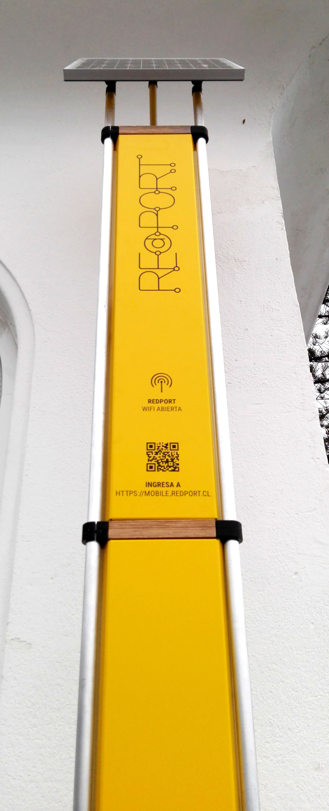
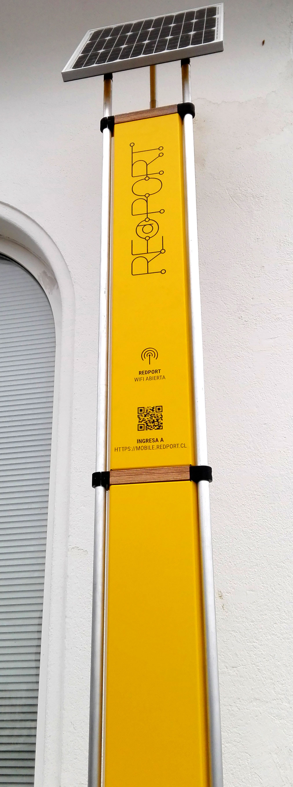
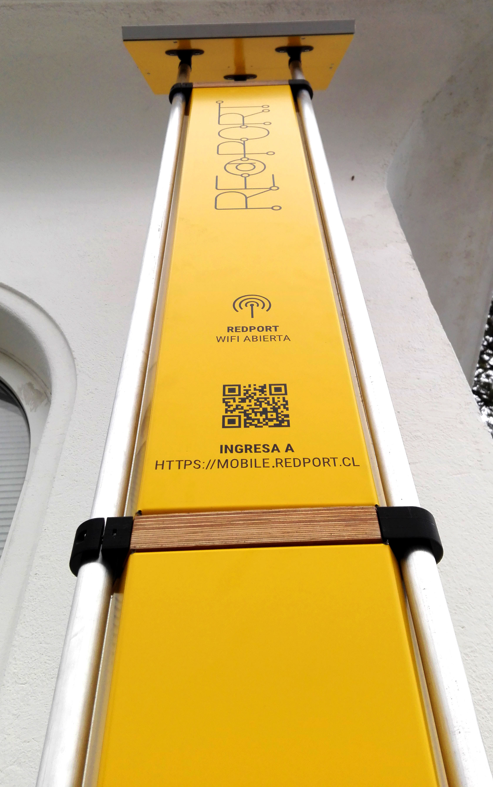
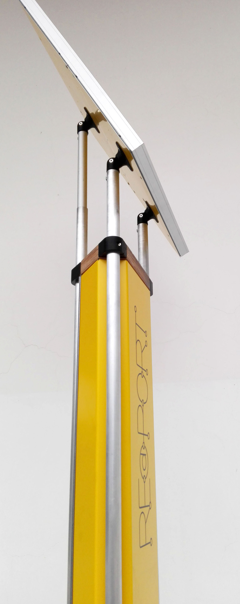
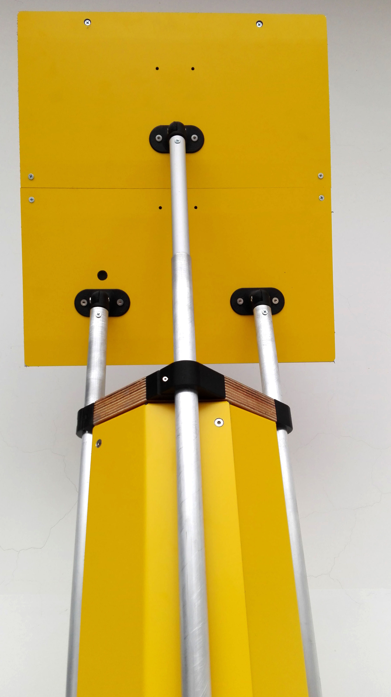
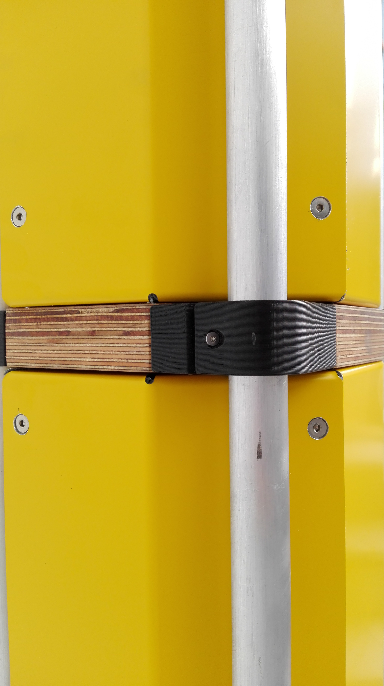
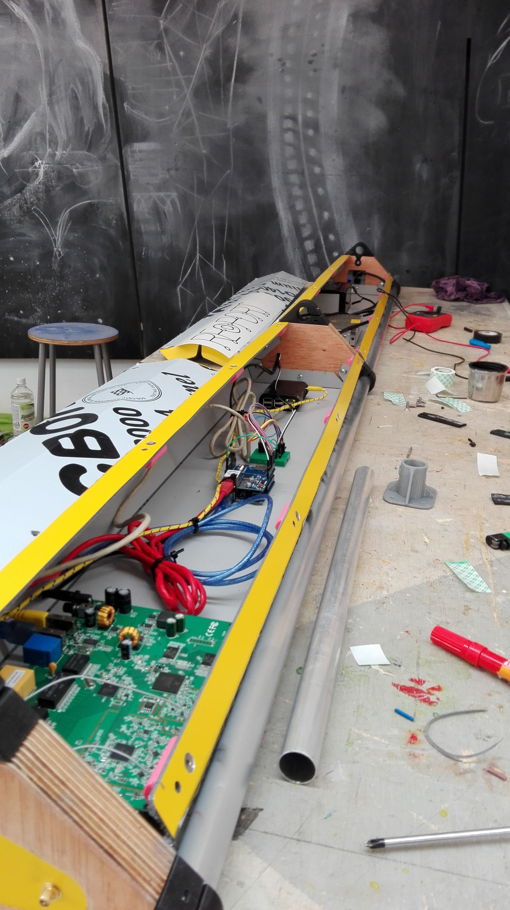
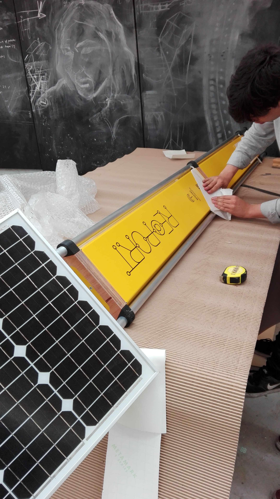
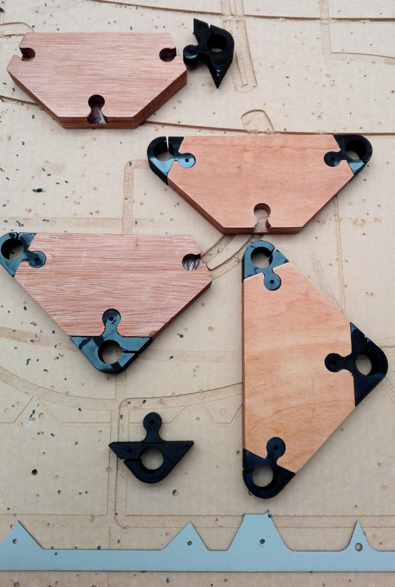
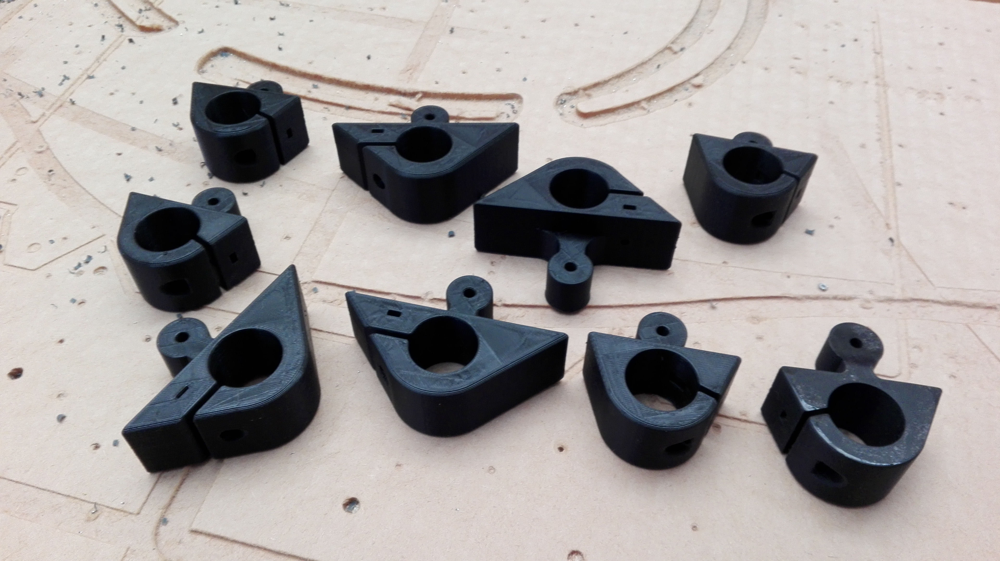

# Antena Mesh REdPORT

## Video de ensamblado

En este [vínculo](http://a360.co/2iPRPUU "Archivo en Autodesk Fusion 360") puedes revisar el modelo 3D online y descargarlo en Fusion 360. Además en este repositorio encontrarás los archivos originales en Inventor 2016.

## Componentes

* Tubos de aluminio 25mm
* Terciado Marino 30mm
* MelicBond (Aluminio compuesto 3mm)
* Nodos 3D PLA negro 

## Antena Completa

## Proceso Fabricación 

## Proceso Fabricación 

Primer prototipo del proyecto en el marco del FabAcademy 2016.
http://archive.fabacademy.org/archives/2016/fablabsantiago/students/391/final.html

